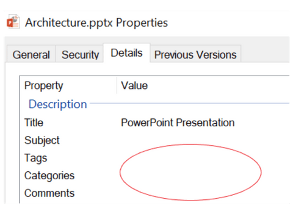
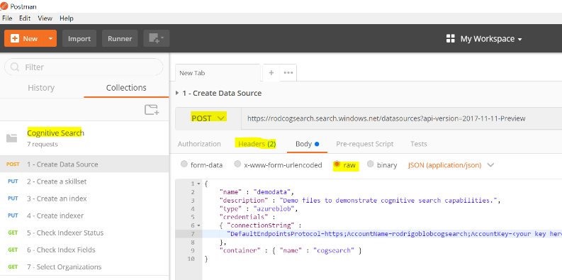

# Solution Architecture

In this workshop you will learn how to create a Cognitive Search solution for Enterprise Documents. 

Cognitive Search is an Azure Search feature that lets you use artificial intelligence to extract insights and structured information from business documents like pdf, ppt, docx, xls, html and more. We will create pipelines that use cognitive skills to enrich and bring structure to your data before it gets indexed. 

This solution uses a variety of pre-built cognitive skills and extend the feature by adding a custom skills.

## Use Case

Every company has business documents: contracts, memos, presentations, images, spreadsheets. Usually these documents lack metadata necessary to be searchable. Cognitive Search uses the most advanced cognitive capabilities, based on Microsoft's AI Platform, 
to extract and create enriched metadata about your documents, vastly improving the overall search experience.

This Lab solution addresses this problems, extracting insights from multiple documents formats and languages.

> Since we are working with unstructured data, any set of files can be used. In other words, this could be a **Bring Your Own Data** solution; you can test later with any dataset you want.  
> Some other possible uses for the labs could be:  
>  
>  + Demos: You could keep an environment ready, loaded. 
>  + POCs: You just need to upload some of the client's data and re-execute the enrichment pipeline. **You can prove the concept in front of the client, in minutes**.
>  + Production: Since we are using PaaS, it has SLA and scalability by design.
>  + Personal Use: If you have lots of documents or photos, you can use these labs to analyze them, too.

## Labs Architecture

Please note that:

1. We will provide a sample dataset. This dataset contains documents with multiple languages and formats including HTML, doc, pdf, ppt, png and jpg. They were selected for a better learning experience, showcasing most of the technology capabilities.
2. You can upload the data to blob storage using [Azure Portal](https://docs.microsoft.com/en-us/azure/storage/blobs/storage-quickstart-blobs-portal) or [Azure Storage Explorer](https://docs.microsoft.com/en-us/azure/storage/blobs/storage-quickstart-blobs-storage-explorer), among other options.
3. We will start with a few simple skills and add more complex Cognitive Skills in labs 2 and 3.
4. We will use Azure Search query capabilities to analyze the results.

## Demo - Cognitive Search Pipeline

The [AI Sandbox](https://text-analytics-demo-dev.azurewebsites.net/) is an interesting demo of the Cognitive Search Pipeline, similar to what will be implented. It is useful to understand how a cognitive skill output is input for another one, in the same pipeline.
This demo is public and you can use with clients and partners.

## Costs
Here you can see a list of the resources used in this training. The [Azure Calculator](https://azure.microsoft.com/en-us/pricing/calculator/) can be used for a pricing estimation. 
Prices are estimates and are not intended as actual price quotes. Actual prices may vary depending upon the date of purchase, currency of payment, and type of agreement you enter with Microsoft. Contact a Microsoft sales representative for additional information on pricing.
**The estimated daily cost of this training, with the provided data source, is close to 15,00.**  

| Item | Detail | Description
|-------|----------|----------|
| Blob Storage | 20 MB |To store the documents |
| Azure Search | Basic Tear: 16 documents, 1 index | To execute all cognitive processing |
| Azure Functions | Up to 100 executions| To host and execute the custom cognitive service we will create |
| Cognitive Services | Up to 100 executions, 1000 seconds | To execute the custom cognitive service | 

## Information Delivery - User Interface
Building an interface is not in the scope of this one day training, but we will address the topic by listing the possible options for a Cognitive Search solution.

The enriched metadadata created by the Cognitive Search Pipeline is always loaded to an Azure Search Index. **How the final users would benefit from that?** 

+ Web and Mobile applications can search this index using the [Azure Search .net SDK](https://docs.microsoft.com/en-us/azure/search/search-query-dotnet) 
or the [Azure Search Rest API](https://docs.microsoft.com/en-us/azure/search/search-query-rest-api). This applications will translate user's search parameters into an Azure Search Query, what will retrieve the metadada from the Azure Search Index. 
One of the stored information is the file location, allowing users to visualize, download and open the documents.

+ Another option is a [Search Bot](https://docs.microsoft.com/en-us/azure/bot-service/dotnet/bot-builder-dotnet-search-azure?view=azure-bot-service-3.0), a CaaP (Conversation as a Platform) interface for interactive search using NLP (Natural Language Processing).
In the image below you can see one example of architecture you can build using Cognitive Search, LUIS and a Bot as user interface.

> The Microsoft Learn AI team has a 2 days [Bootcamp Training](https://azure.github.io/LearnAI-Bootcamp/emergingaidev_bootcamp) that shows you how to create an intelligent bot with Azure Search and Cognitive Services.

## Lab Tools for APIs
After the initial data upload to blob storage, we will use Fiddler or Postman for [REST API calls](https://docs.microsoft.com/en-us/azure/search/search-fiddler). The image below shows a visual example of Postman being used for Cognitive Search.

> Important details about these tools (Fiddler and Postman):
> + You can save your commands, which is useful for reuse, not only within this workshop, but also in your future projects.
> + You need to create a free account. A confirmation message is emailed to you.
> + You can export all your commands into json format. This file can then be saved into the storage account of the lab, into a cloud storage like OneDrive, or anywhere you like. This process helps you save, share, and reuse your work.
> + These return codes indicate success after an API call request: 200, 201 and 204. 
> + Error messages and warnings are very clear.
> + Besides the API URL and call type, we will use GET/PUT/POST (depending on what action we are taking), and you need to use the header for Content-Type and api-key. The json commands must be placed into the "body / raw" area. If you are struggling using Postman/Fiddler, here's a friendly reminder to [review the resource from the prerequisites](https://docs.microsoft.com/en-us/azure/search/search-fiddler).

## Next step
[Environment Creation](03-Environment-Creation.md) or [Back to Main Menu](readme.md)

