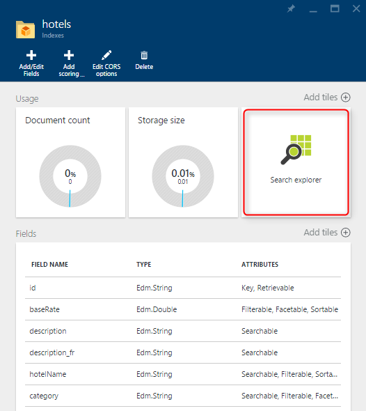
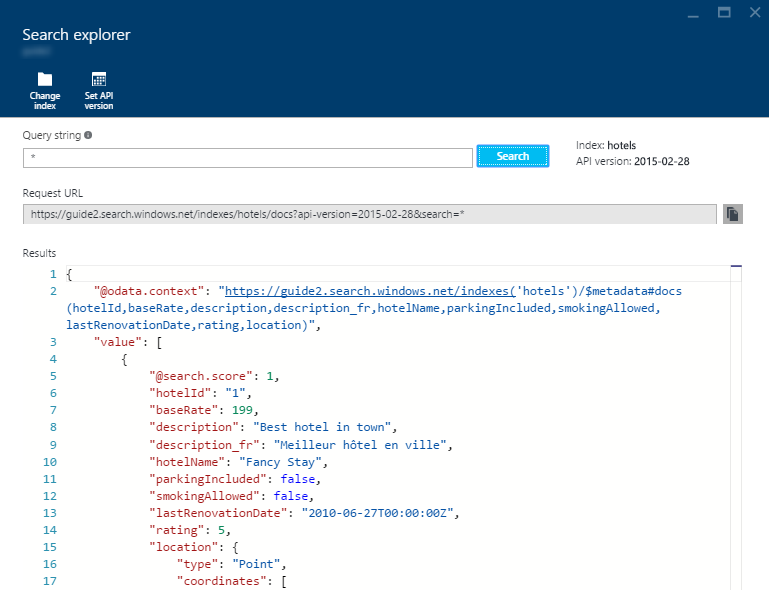

#LAB 3: Mapping enriched fields to a searchable index

Once you have [defined a skillset](cognitive-search-defining-skillset.md), you must map the output fields of any skill that directly contributes values to a given field in your search index. Field mappings are required for moving content from enriched documents into the index.

Our first activity is to read the [mapping documentation](https://docs.microsoft.com/en-us/azure/search/search-indexer-field-mappings) to better understand why we need to do it.

Next step is to map fields. We will add `outputFieldMappings` to your indexer definition as shown below:

```http
PUT https://[servicename].search.windows.net/indexers/[indexer name]?api-version=2017-11-11-Preview
api-key: [admin key]
Content-Type: application/json
```

The body of the request is structured as follows:

```json
{
  "name" : "myIndexer",
  "dataSourceName" : "myDataSource",
  "targetIndexName" : "myIndex",
  "skillsetName" : "myFirstSkillSet",
  "fieldMappings" : [
        {
          "sourceFieldName" : "metadata_storage_path",
          "targetFieldName" : "id",
          "mappingFunction" : { "name" : "base64Encode" }
        }
   ],
  "outputFieldMappings" : [
        {
          "sourceFieldName" : "/document/content/organizations/*/description", 
          "targetFieldName" : "descriptions"
        },
        {
          "sourceFieldName" : "/document/content/organizations", 
          "targetFieldName" : "orgNames"
        },
        {
          "sourceFieldName" : "/document/content/sentiment", 
          "targetFieldName" : "sentiment"
        }
   ]
}
```
For each output field mapping, set the name of the enriched field (sourceFieldName), and the name of the field as referenced in the index (targetFieldName).

The path in a sourceFieldName can represent one element or multiple elements. In the example above, ```/document/content/sentiment``` represents a single numeric value, while ```/document/content/organizations/*/description``` represents several organization descriptions. In cases where there are several elements, they are "flattened" into an array that contains each of the elements. More concretely, for the ```/document/content/organizations/*/description``` example, the data in the *descriptions* field would look like a flat array of descriptions before it gets indexed:

```
 ["Microsoft is a company in Seattle","LinkedIn's office is in San Francisco"]
```

Once you have mapped your enriched fields to searchable fields, you can set the field attributes for each of the searchable fields [as part of the index definition](https://docs.microsoft.com/azure/search/search-what-is-an-index).

##Azure Search Explorer
Now let's query the index with Azure Search Explorer, It is in the Azure portal. You can use Search Explorer to submit simple or full Lucene query strings to any existing index in your service.

## Open the service dashboard
1. Click **All resources** in the jump bar on the left side of the [Azure portal](https://portal.azure.com/#blade/HubsExtension/BrowseResourceBlade/resourceType/Microsoft.Search%2FsearchServices).
2. Select your Azure Search service.

## Select an index

Select the index you would like to search from the **Indexes** tile.

   

## Open Search Explorer

Click on the Search Explorer tile to slide open the search bar and results pane.

   

## Start searching

When using the Search Explorer, you can specify [query parameters](https://docs.microsoft.com/rest/api/searchservice/Search-Documents) to formulate the query.

1. In **Query string**, type a query and then press **Search**. 

   The query string is automatically parsed into the proper request URL to submit a HTTP request against the Azure Search REST API.   
   
   You can use any valid simple or full Lucene query syntax to create the request. The `*` character is equivalent to an empty or unspecified search that returns all documents in no particular order.

2. In  **Results**, query results are presented in raw JSON, identical to the payload returned in an HTTP Response Body when issuing requests programmatically.

   

## See Also

The following resources provide additional query syntax information and examples.

 + [Simple query syntax](https://docs.microsoft.com/rest/api/searchservice/simple-query-syntax-in-azure-search) 
 + [Lucene query syntax](https://docs.microsoft.com/rest/api/searchservice/lucene-query-syntax-in-azure-search) 
 + [Lucene query syntax examples](https://docs.microsoft.com/azure/search/search-query-lucene-examples) 
 + [OData Filter expression syntax](https://docs.microsoft.com/rest/api/searchservice/odata-expression-syntax-for-azure-search) 


## Next Step
[Back to Labs Menu](readme.md)